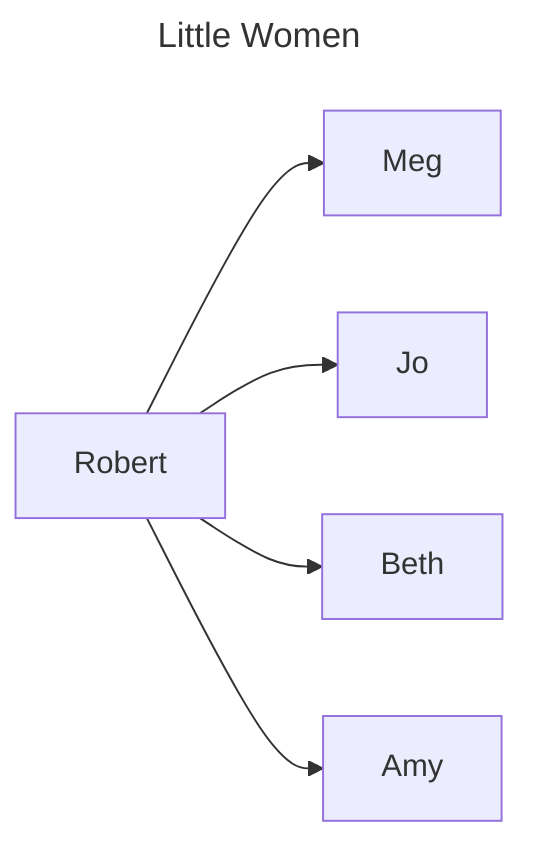

# Python-Mermaid
This modules aims to implement a simple way for developers/admin-sys/devops to create on-the-fly [Mermaid diagrams](https://mermaid.js.org/).

## Installation
```shell
pip install python-mermaid
```

## Getting started
```py
# Creating a simple flowchart diagram
from python-mermaid import FlowChart

the_march_family = [
    ("Meg","M"),
    ("Jo", "J"),
    ("Beth"."B"),
    ("Amy", "A"),
    ("Robert March","RM")
]

links = [
    ("Robert March", "Meg"),
    ("Robert March", "Jo"),
    ("Robert March", "Beth"),
    ("Robert March", "Amy"),
]

chart = Flowchart(
    title="Little Women",
    nodes=the_march_family,
    links=links
)

print(chart)
```
Returns the following
```txt
---
title: "Little Women"
---
graph LR
M["Meg"]
J["Jo"]
B["Beth"]
A["Amy"]
RM["Robert"]

RM --> M
RM --> J
RM --> B
RM --> A
```
which results in the following diagram


## Roadmap
- [ ] *flowchart* setup
- [ ] Add *styles* for nodes or links
- [ ]

## Contribute
Wanna help ? Find a bug ?
1. Do not hesitate to fork the repository and send PRs with your changes
2. No time to code ? Send a bug/feature issue [here](https://github.com/Dynnammo/python-mermaid/issues/new/choose)